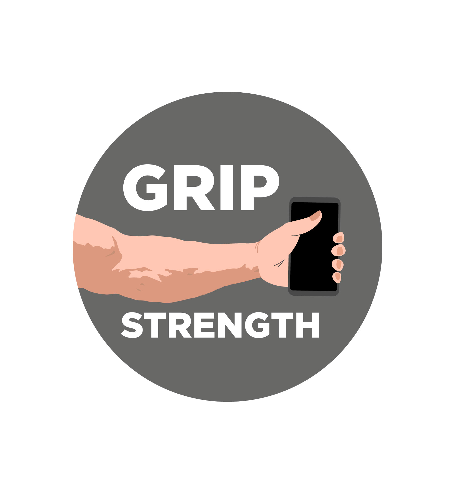

<!--
*** Thanks for checking out this README Template. If you have a suggestion that would
*** make this better, please fork the repo and create a pull request or simply open
*** an issue with the tag "enhancement".
*** Thanks again! Now go create something AMAZING! :D
-->


<!-- PROJECT SHIELDS -->
<!--
*** I'm using markdown "reference style" links for readability.
*** Reference links are enclosed in brackets [ ] instead of parentheses ( ).
*** See the bottom of this document for the declaration of the reference variables
*** for contributors-url, forks-url, etc. This is an optional, concise syntax you may use.
*** https://www.markdownguide.org/basic-syntax/#reference-style-links
-->
<!-- [![Contributors][contributors-shield]][contributors-url] -->
[![Forks][forks-shield]][forks-url]
[![Stargazers][stars-shield]][stars-url]
[![Issues][issues-shield]][issues-url]
[![MIT License][license-shield]][license-url]
[![LinkedIn][linkedin-shield]][linkedin-url]


<!-- PROJECT LOGO -->
<br />
<p align="center">
  <a href="https://github.com/VitoMinheere/flutter_grip_trainer">
    
  </a>

  <h3 align="center">Flutter grip trainer</h3>

  <p align="center">
    A grip training app based on the Convict Conditioning series.
    <br />
    <a href="https://github.com/VitoMinheere/flutter_grip_trainer"><strong>Explore the docs »</strong></a>
    <br />
    <br />
    <a href="https://github.com/VitoMinheere/flutter_grip_trainer">View Demo</a>
    ·
    <a href="https://github.com/VitoMinheere/flutter_grip_trainer/issues">Report Bug</a>
    ·
    <a href="https://github.com/VitoMinheere/flutter_grip_trainer/issues">Request Feature</a>
  </p>
</p>


<!-- TABLE OF CONTENTS -->
## Table of Contents

* [About the Project](#about-the-project)
  * [Built With](#built-with)
* [Getting Started](#getting-started)
  * [Prerequisites](#prerequisites)
  * [Installation](#installation)
* [Usage](#usage)
* [Roadmap](#roadmap)
* [Contributing](#contributing)
* [License](#license)
* [Acknowledgements](#acknowledgements)


<!-- ABOUT THE PROJECT -->
## About The Project

Strengthen your grip without the need for weights or exercise machines. All you need is a pull up bar, a hoprizontal bar(or something to put under your legs for the pull up bar) and towels.

The progressions are taken form the book Convict Conditioning 2. I wanted a simple way of tracking my progression without having to write it down everytime.

All data is stored locally on the device in an SQLite database. No connection is made to the internet and no permissions are necessary.

During the exercise some music is playing to indicate that the timer is running and to motivate the user to keep holding on.


### Built With
See the `pubspec.yaml` for versions.

* [Flutter](https://flutter.dev/)
* [Provider](https://pub.dev/packages/provider)
* [SQFlite](https://pub.dev/packages/sqflite)
* [path](https://pub.dev/packages/path)
* [audioplayers](https://pub.dev/packages/audioplayers)


<!-- GETTING STARTED -->
## Getting Started

To build the app locally on an emulator or to your own device, make sure you installed flutter and all its components documented [here](https://flutter.dev/docs/get-started/install).

### Prerequisites

* dart packages
```
pub get
```

### Installation

No need to load anything to test the application. The used data is in `assets/grip_trainer.db`.
When you run the app and there is no associated db file on the phone, this file will be used and moved to the OS standard path.

If you mess up the data in your db, simply remove the db file from your device or change the db name in `lib/data/database_provider`


<!-- USAGE EXAMPLES -->
## Usage

Use this space to show useful examples of how a project can be used. Additional screenshots, code examples and demos work well in this space. You may also link to more resources.

_For more examples, please refer to the [Documentation](https://example.com)_


<!-- ROADMAP -->
## Roadmap

See the [open issues](https://github.com/VitoMinheere/flutter_grip_trainer/issues) for a list of proposed features (and known issues).


<!-- CONTRIBUTING -->
## Contributing

Contributions are what make the open source community such an amazing place to be learn, inspire, and create. Any contributions you make are **greatly appreciated**.

1. Fork the Project
2. Create your Feature Branch (`git checkout -b feature/AmazingFeature`)
3. Commit your Changes (`git commit -m 'Add some AmazingFeature'`)
4. Push to the Branch (`git push origin feature/AmazingFeature`)
5. Open a Pull Request


<!-- LICENSE -->
## License

Distributed under the GNU/GPL v3 License. See `LICENSE` for more information.


<!-- ACKNOWLEDGEMENTS -->
## Acknowledgements
* [Convict Conditioning 2](https://www.amazon.com/Convict-Conditioning-Advanced-Training-Bulletproof-ebook/dp/B0097AMVXS/)
* [Shields](https://shields.io)
* [Bensound](https://www.bensound.com/)
* [Freesound](https://freesound.org/)
* [Choose an Open Source License](https://choosealicense.com)
* [Timer Countdown Widget](https://medium.com/flutterdevs/creating-a-countdown-timer-using-animation-in-flutter-2d56d4f3f5f1)
* [GitHub Pages](https://pages.github.com)


<!-- MARKDOWN LINKS & IMAGES -->
<!-- https://www.markdownguide.org/basic-syntax/#reference-style-links -->
<!-- [contributors-shield]: https://img.shields.io/github/contributors/othneildrew/Best-README-Template.svg?style=flat-square -->
<!-- [contributors-url]: https://github.com/VitoMinheere/flutter_grip_trainer/graphs/contributors -->
[forks-shield]: https://img.shields.io/github/forks/VitoMinheere/flutter_grip_trainer
[forks-url]: https://github.com/VitoMinheere/flutter_grip_trainer/network/members
[stars-shield]: https://img.shields.io/github/stars/VitoMinheere/flutter_grip_trainer
[stars-url]: https://github.com/VitoMinheere/flutter_grip_trainer/stargazers
[issues-shield]: https://img.shields.io/github/issues/VitoMinheere/flutter_grip_trainer
[issues-url]: https://github.com/VitoMinheere/flutter_grip_trainer/issues
[license-shield]: https://img.shields.io/github/license/VitoMinheere/flutter_grip_trainer
[license-url]: https://github.com/VitoMinheere/flutter_grip_trainer/blob/master/LICENSE.txt
[linkedin-shield]: https://img.shields.io/badge/-LinkedIn-black.svg?style=flat-square&logo=linkedin&colorB=555
[linkedin-url]: https://linkedin.com/in/vitominheere
[product-screenshot]: images/screenshot.png

